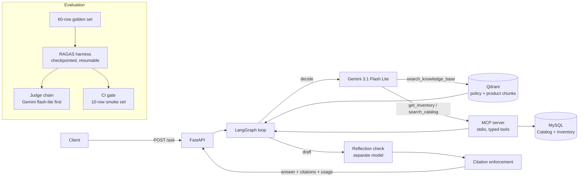

# QuickCommerce Copilot

**Author:** Rahul Meena
**GitHub:** https://github.com/Jharwal77
An agentic RAG assistant for quick-commerce catalog and operations questions, for support
agents and dark-store staff who need one correct answer fast: it retrieves from a policy and
product knowledge base, calls live inventory tools over MCP, and refuses when the evidence
is not there.

**Live demo:** https://quickcommerce-copilot.onrender.com. An operations console: ask a question, read the agent trace (retrieval, each tool call with arguments and latency, the reflection verdict, the citation guardrail), and click any `[n]` marker to see the evidence behind it. A "What I know" tab lists policies, stores, brands, and categories straight from the data; one example chip is deliberately out of scope so the refusal path is visible. API: `/health`, `/meta`, `POST /ask`, `/docs`. Free instance: the first request after idle takes about a minute. Share a question with `/?q=...`.

## Architecture



## Why wrong answers are expensive here

Quick-commerce support runs on minutes. A wrong return window is a refund the policy did not owe; an invented stock figure is a promise the picker cannot keep. Refund abuse and perishable write-offs are the two largest controllable loss lines in this business, and both hinge on the first answer an agent gives. The goal was therefore not fluency but a low rate of confident, unsupported claims, and a system that says "I don't have that" rather than guess.

## Results

Numbers are on the **full 60-row golden set** (`eval/golden/golden_set.jsonl`: 50
knowledge-base rows, 10 live-tool rows). The agentic run was collected and judged across
four days of free-tier quota resets with on-disk checkpointing (2026-09-09 to 2026-09-12);
the earlier 30-row subset results remain in `eval/results/*_30.json`. Baseline is classic
retrieve-then-generate; "agentic" is the LangGraph loop with tools, reflection, and citation
enforcement. Reports live in `eval/results/` and `reports/perf.json`.

| Metric | Baseline (retrieval-only) | Agentic + guardrails | Read as |
|---|---|---|---|
| Tool-call success on live-tool rows (10) | **2 / 10** | **10 / 10** | The headline. The baseline's two are catalog rows where a cited answer from the indexed product docs counts; it refused all eight inventory rows. The agent answered every row via `search_catalog` then `get_inventory`. |
| Citation coverage | 0.56 | **1.00** | Every returned sentence now points at a passage or tool result (50 and 49 committed answers). |
| Refusals on live-tool rows | 8 / 10 (correct with no tools) | 0 / 10 | Nothing a tool could answer was left unanswered. |
| Live rows answered without a tool | 0 | 0 | Neither pipeline invented a stock figure. |
| Wrong refusals on knowledge-base rows | 0 / 50 | 1 / 50 | One answerable question was refused by the citation guardrail; it is a stricter system and this is the price. |
| Hallucination rate | 0.00 | 0.00 | Held at zero (faithfulness below 0.5 on 0 of 50 and 0 of 49 scored answers). |
| Faithfulness / relevancy / precision / recall (RAGAS) | 0.997 / 0.875 / 0.922 / 1.000 | 0.953 / 0.786 / 0.888 / 0.980 | Not held at ceiling on the full set. Faithfulness fell 0.044, inside the 0.05 gate margin; relevancy fell 0.089, which is more than judge noise. See below. |
| Latency p50 / p95 | 6.6 s / 9.4 s | 7.4 s / 61.7 s | Up to three tool calls plus a reflection pass per question, and p95 is dominated by free-tier rate-limit waits and provider failovers. |
| Cost per 1,000 queries (list prices) | $0.14 | $0.37 | 3.7k vs 1.0k tokens per query; actual spend on free tiers was $0. |

The finding is the first two rows: retrieval-only had no way to answer a live-stock question;
the agentic system answered all ten, every claim cited, at zero hallucination. The RAGAS
columns are the stated trade-off, not a footnote. Two things moved them. The answer model
changed under the run: the baseline was answered entirely by `groq:openai/gpt-oss-20b`,
while 37 of the agentic answers came from `gpt-oss-120b` and 13 from OpenRouter's Nemotron
after Groq's daily cap, so part of the relevancy gap is a model gap. And reflection plus
citation enforcement shorten answers, which the relevancy judge penalises. The full-set gate
(`make gate`) passes: candidate faithfulness 0.953 against a threshold of 0.947, a narrow
pass, with tool-call success at or above baseline.

**CI has produced an enforced PASS.** On 2026-09-12 the smoke workflow ran with Groq
`gpt-oss-20b` available, so the 10-row smoke set was answered by the same model as the smoke
baseline and the gate enforced rather than warned: faithfulness within 0.05 of baseline and
tool-call success not below it
([run 34700984665](https://github.com/Jharwal77/quickcommerce-copilot/actions/runs/34700984665)).

Scoring: RAGAS is judged on knowledge-base rows only; live-tool rows are scored
deterministically as tool-call success (expected tool invoked, returned without error,
answer committed). The judge is Gemini flash-lite with failover; every score records its
judge, and 43 to 46 of the 50 agentic rows per metric were judged by `gemini-3.5-flash-lite`.

## Stack and why

| Choice | Reason |
|---|---|
| LangGraph explicit loop | Decide, act, reflect are named nodes with hard caps on tool calls and turns; the loop cannot run away and every step is inspectable. |
| MCP server over stdio | Typed, schema-validated, read-only tools callable by any MCP client, not only this agent. |
| MySQL | Relational catalog, store, and inventory database used by the MCP tools. |
| Qdrant | Docker locally, embedded mode inside the image, one client for both. |
| MiniLM embeddings, two backends | sentence-transformers locally and in CI; the same model via onnxruntime in the image, which drops torch and fits a 512 MB instance. Vectors agree to cosine 1.000. |
| Gemini 3.1 Flash Lite | Current answer, reflection, and evaluation model configuration used by the project. |
| RAGAS with Gemini as judge | Standard metrics, a judge that is not the answerer, and per-score judge attribution. |
| Pydantic everywhere | Request, response, tool, golden-set, and settings schemas fail loudly instead of skewing a metric quietly. |
| FastAPI | Serves the API and coordinates the LangGraph agent, MCP tools, Qdrant retrieval, and frontend integration. |
| Vite, React, TypeScript, Tailwind console | Built in a Docker stage, served as static files by FastAPI: no Node at runtime. Strict TypeScript, about 100 KB gzipped, dark and light themes, keyboard accessible. |

## Quickstart

```bash
git clone https://github.com/Jharwal77/quickcommerce-copilot
cd quickcommerce-copilot
cp .env.example .env            # add GEMINI_API_KEY
make venv                       # Python 3.11 virtualenv via uv
make up                         # start Qdrant on :16333
make seed ingest                # load the tools database, build the knowledge base
make test                      # run the test suite
make api                        # http://localhost:8088/docs (API); cd frontend && npm install && npm run dev for the console
curl -s localhost:8088/ask -H 'content-type: application/json' \
  -d '{"question":"How many units of Nandhini Fresh Paneer 200 g are available at the Indiranagar Dark Store?"}'
```

`make eval-baseline` and `make eval-after` run both pipelines and resume from checkpoints when
a provider caps out; `make gate`, `make smoke` (what CI runs), and `make image` do what they say.

## Two documented failure cases

**1. A protocol field the OpenAI schema does not name.** In CI, with Groq's daily cap spent,
the answer chain fell through to Gemini and every tool question died on its second turn with
HTTP 400: "Function call is missing a thought_signature in functionCall parts". Gemini's
OpenAI-compatible endpoint attaches `extra_content.google.thought_signature` to each tool
call and requires it back verbatim; the client rebuilt the assistant message from id, name,
and arguments, which is all the schema promises. Locally this never showed, because Groq
answered first. **Fix:** the echoed tool call now starts from the SDK's full dump of the
response object, with a regression test and a probe that fails stripped and passes intact.
The next run found the second half: a conversation started on Groq and failed over to
Gemini mid-way carries a tool call with no signature, so unsigned calls now get Google's
documented placeholder before a Gemini request. **Lesson:** "OpenAI-compatible" covers the request shape, not the conversation protocol, and
a fallback chain will eventually exercise every provider's quirks in the place you test least.

**2. A guardrail stricter than the model's punctuation.** The first full agentic run refused
half the knowledge-base questions it had answered correctly a day earlier, and tool rows
fared worse: the agent fetched the right stock figure and still said "I don't have that in
the knowledge base." The answer model writes citation markers as `【1】`; the guardrail
matched only `[1]`, dropped every sentence as uncited, and the empty result became a
refusal, after reflection had already approved the draft. Five golden rows also still
expected an order-status tool that had been cut from scope and masked the size of the
problem. **Fix:** `normalize_markers` rewrites `【n】`, `[n, m]`, and spaced variants before
reflection and enforcement; the five rows became inventory questions with computed ground
truths; every sample records which model produced it.

**The dependency story underneath.** `ragas` 0.4.3 imports pre-1.0 `langchain` at import
time and its Groq adapter was broken, so the judge uses the OpenAI-compatible surface with
`langchain-core<1.0` pinned and the reason recorded in `pyproject.toml`. More decisions and
their evidence are in `DESIGN_NOTES.md`.

## Limitations and honest notes

- **All data is synthetic.** Products, brands, stores, inventory, and orders come from
  `scripts/generate_data.py` with a fixed seed; the policies were written for a fictional
  operator, "Nimbus Now". Nothing here describes a real company.
- **Free-tier providers shape the numbers.** Latency includes rate-limit waits and the eval
  was checkpointed across daily quota resets. Every score records its judge; every answer
  records its model.
- **The judge is an LLM, and baseline faithfulness was already at the ceiling.** The
  meaningful movement is in tool-call success, citation coverage, and refusals.
- **Headline numbers took four days of quota resets; CI gates on a 10-row smoke set.** A full
  judged run does not fit in one day of free-tier budget, so it was checkpointed and resumed
  (`make eval-full`). CI gates on faithfulness within 0.05 of the smoke baseline and on
  tool-call success not regressing. Before the smoke eval,
  `make preflight` makes one authenticated request per provider so a rejected key fails
  the job in seconds with the provider's own error. Free-tier daily caps are shared with
  local runs, so two more outcomes are warnings rather than failures: every provider capped
  (the eval exits 2), and answers produced by a different model than the one behind the
  smoke baseline (the gate exits 3 and names both models). A faithfulness gap between two
  models says nothing about the commit, so the gate only enforces when the answer model
  matches; the 0.05 margin itself is never loosened.
- **Deployment.** The free host provides 512 MB; the image sits near 350 MB resident and
  cold starts take about a minute. `get_order_status` was dropped from scope; two tools ship.
